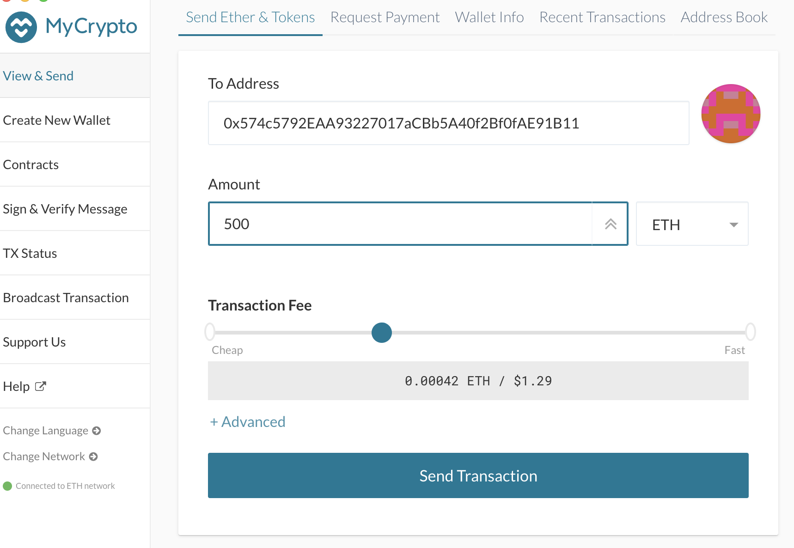

# How to Set up a Proof of Authority Testnet Chain

### Getting Started

1. Make sure you have installed the [MyCrypto](https://www.mycrypto.com/) app and have downloaded the [Go Ethereum](https://geth.ethereum.org/) version 1.9.7 tool kit before proceeding with the below steps. 

2. Create a new project directory for your new netowork inside your Blockchain-Tools directory. You can name this whatever you like 

### Creating Nodes

3. cd .. back into your Blockchain-Tools directory and create two new nodes for your new network with a separate **datadir** for each using **geth**. Repeat this step for node2 and make sure to save your node passwords and addresses in a separate file for later use.
* ./geth --datadir node1 account new
* ./geth --datadir node2 account new 

Node 1 
Public address of the key:   0x93f267b32cC73e8250B3b61AcF575F8e97B2dF88

Node 2
Public address of the key:   0x574c5792EAA93227017aCBb5A40f2Bf0fAE91B11

### Creating the Genesis Block

4. Run **puppeth** on your terminal, create a name for your network. You must be inside the Blockchain-Tools directory when creating the Genesis Block. 
* ./puppeth

5. Navigate through the prompts as shown below. We are using the default number of seconds (15 seconds) needed per block. Make sure to paste both addresses of your two nodes, excluding the 0x, when prompted to. 

6. When prompted if you would like the precompile-addresses to be pre-funded with 1 wei, you can selece "no", then navigate through the following prompts as shown below.

7. When asked "Which folder to save the genesis specs into?" hit enter and this will choose the (default = current) option which would be networkname.json.

8. Once complete, exit puppeth by using the ctrl+C key combination.

### Initializing Nodes

9. Initialize each node using **geth** and the new **netorkname.json**
* ./geth --datadir node1 init syra303.json
* ./geth --datadir node2 init syra303.json

10. Start a mining thread/node (node1) and make sure to save the enode address (highlighted in photo below) as you will be using this address as the bootnode flag for your second address.
* ./geth node1 --unlock "93f267b32cC73e8250B3b61AcF575F8e97B2dF88" --mine --rpc --allow-insecure-unlock

11. To start mining, open a new terminal and navigate to the Blochchain-Tools directory. Set a different peer port for the second node and use the first node's enode address as the bootnode flag. 
* ./geth --datadir node2 --unlock "574c5792EAA93227017aCBb5A40f2Bf0fAE91B11" --mine --port 30304 --bootnodes "enode://bc13dfea1f630695adf0d3917ee445a0e13613a8ccb886336ea9237ce7780d9a5b182b322db511dff85968cf9fe59e2c705b08d33e3e0cea3b25a0e5fd4b36c8@127.0.0.1:30303" --ipcdisable --allow-insecure-unlock

### Sending Transactions

12. Open MyCrypto and click "Add Custom Node" then input your custom network information

13. Import the Keystore file that was saved into the BlockTools directory after you created your nodes. This will import your private key.

14. Send a transaction from your node1 address to your node2 address

15. Copy the transaction hash and paste it into the "TX Status" in the app or click "TX Status"

